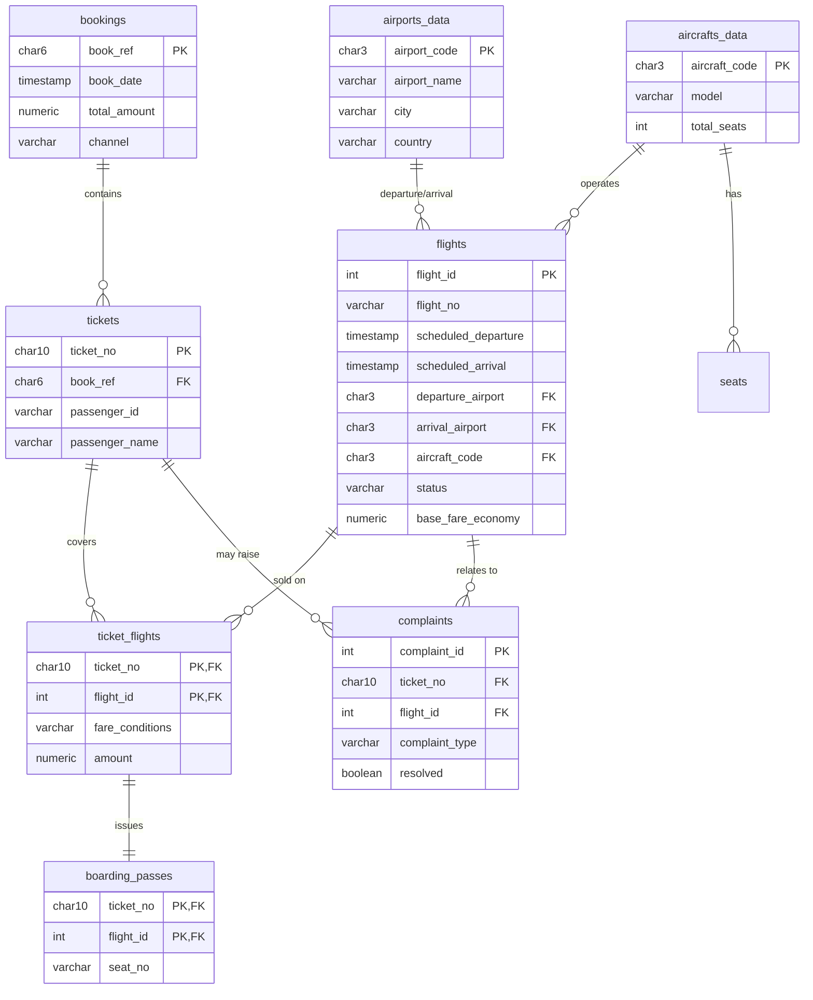

# Entity-Relationship Diagram

**Design notes**

- `bookings` → `tickets` → `ticket_flights` mirrors real airline reservation systems (a booking can hold multiple passengers, each ticket can span multiple flight legs).
- `ticket_flights.amount` is the actual revenue line — this is what ticket-sales and revenue queries aggregate.
- `complaints` is linked to both `tickets` and `flights` so complaint rates can be sliced by route, aircraft, or booking channel — needed to support the "reduction in customer complaints" analysis.
